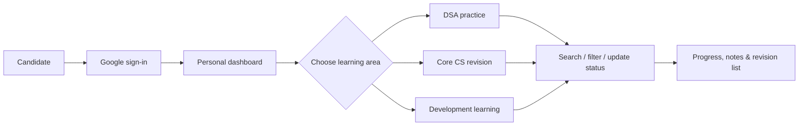
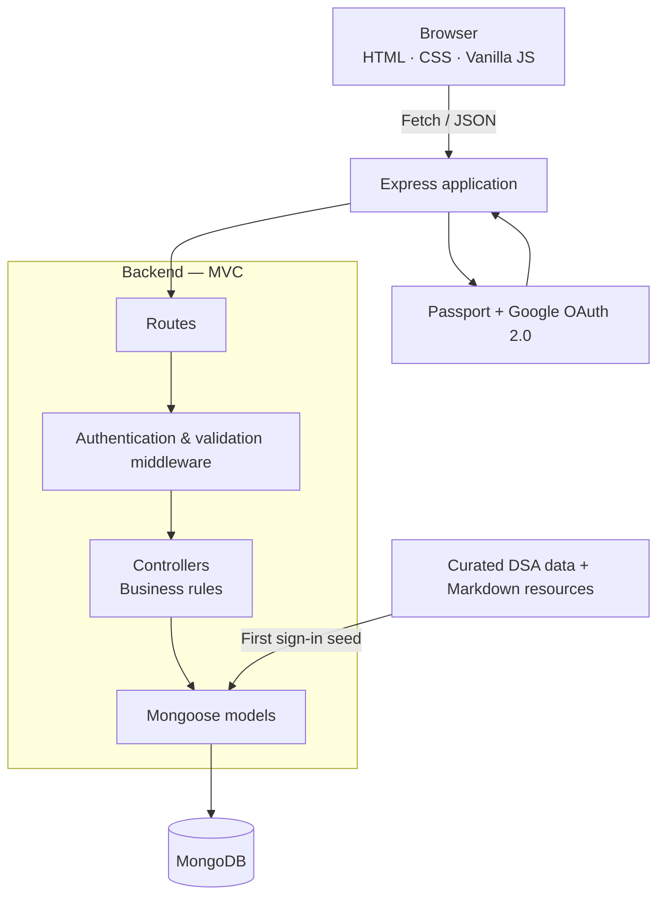
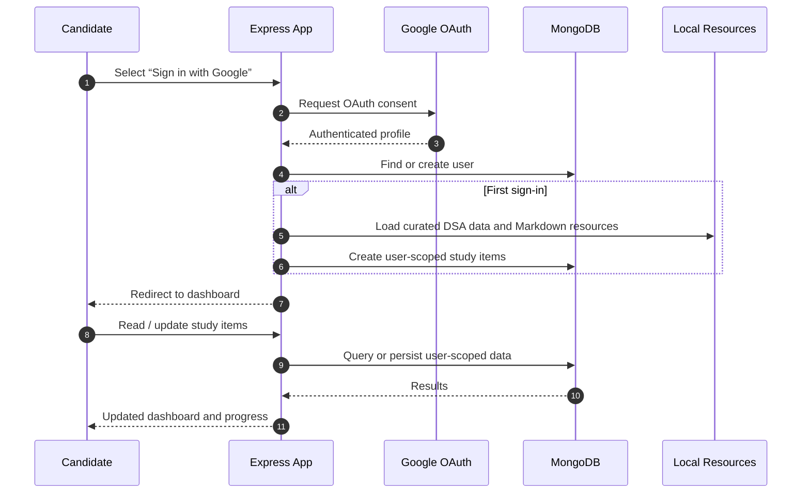

# Placement Preparation Tracker

> A full-stack study workspace that helps software-engineering candidates organize DSA practice, Core CS revision, and development learning in one place.

**Live demo:** [placement-preparation-trackerr.onrender.com](https://placement-preparation-trackerr.onrender.com/)

[](https://nodejs.org/)
[](https://expressjs.com/)
[](https://www.mongodb.com/)
[](https://developer.mozilla.org/docs/Web/JavaScript)
[](https://developers.google.com/identity)

## Recruiter Snapshot

| Area | Highlights |
| --- | --- |
| **Problem solved** | Consolidates scattered placement-preparation resources into a personalized, progress-aware dashboard. |
| **Full-stack scope** | Vanilla JavaScript frontend, Express REST API, MongoDB/Mongoose data layer, and Passport-based authentication. |
| **Data ownership** | Every question is linked to its authenticated user; protected routes prevent cross-user access. |
| **Product features** | Search, company/topic filters, category tabs, solved status, progress metrics, favourites, notes, and CRUD for questions. |
| **Content strategy** | Curated DSA data plus Markdown-derived Core CS and development content are seeded for new users. |
| **Engineering practices** | MVC separation, request validation, centralized error handling, session management, and indexed duplicate checks. |

## What Users Can Do

- Sign in securely with Google—no application passwords are stored.
- Track DSA questions by company, topic, difficulty, status, and resource link.
- Switch between **DSA**, **Core CS**, **Development**, and a starred **Revision** view.
- Search instantly and narrow material using company and topic filters.
- Mark items solved, monitor a live completion percentage, and revisit starred items.
- Save personal notes against any question or study topic.
- Read seeded DBMS, OOPS, JavaScript, Node.js, React, and database study material inside the dashboard.

## Product Flow



## Architecture



## First Sign-In and Data Flow



## REST API at a Glance

All question endpoints require an authenticated session.

| Method | Endpoint | Purpose |
| --- | --- | --- |
| `GET` | `/api/questions` | Lists the user’s questions; supports search, company, topic, difficulty, status, category, and starred filters. |
| `GET` | `/api/questions/:id` | Returns one user-owned question. |
| `POST` | `/api/questions` | Creates a question after validation. |
| `PUT` | `/api/questions/:id` | Updates status, notes, favourite state, or question metadata. |
| `DELETE` | `/api/questions/:id` | Removes a user-owned question. |
| `GET` | `/api/auth/google` | Starts Google OAuth authentication. |
| `GET` | `/api/auth/current_user` | Returns the active user session. |
| `GET` | `/api/auth/logout` | Ends the active session. |

## Tech Stack

| Layer | Technology | Role |
| --- | --- | --- |
| Client | HTML, CSS, Vanilla JavaScript | Responsive UI, interactive filters, dashboard rendering, and API requests. |
| Server | Node.js, Express 5 | Static-file delivery, routing, REST API, middleware, and error handling. |
| Database | MongoDB, Mongoose | Per-user question records, schema rules, and indexed duplicate detection. |
| Authentication | Passport.js, Google OAuth 2.0, express-session | Sign-in and session-backed protected routes. |
| Content | Local Markdown resources | Structured Core CS and development study material for seeding. |

## Local Setup

### Prerequisites

- [Node.js](https://nodejs.org/) 18 or later
- A local MongoDB instance or a MongoDB Atlas connection string
- Google OAuth 2.0 credentials from the [Google Cloud Console](https://console.cloud.google.com/)

### Run locally

```bash
git clone https://github.com/Rishikajain123-tech/Placement-Preparation-tracker.git
cd Placement-Preparation-tracker
npm install
```

Copy `.env.example` to `.env`, then supply your values:

```env
MONGODB_URI=mongodb://localhost:27017/placement-tracker
PORT=5000
NODE_ENV=development
GOOGLE_CLIENT_ID=your_google_client_id
GOOGLE_CLIENT_SECRET=your_google_client_secret
SESSION_SECRET=use_a_long_random_value
```

Start the development server:

```bash
npm run dev
```

Open [http://localhost:5000](http://localhost:5000). For a non-watching production-style run, use `npm start`.

## Project Structure

```text
Placement-Preparation-tracker/
├── public/                    # Landing page, dashboard, styles, client-side JavaScript
├── resources/                 # Markdown learning material used during first-user seeding
├── src/
│   ├── config/                # Environment, MongoDB, and Passport configuration
│   ├── controllers/           # Request handling and business rules
│   ├── data/                  # Curated DSA dataset and resource seeding
│   ├── middleware/            # Authentication, validation, and error handling
│   ├── models/                # Mongoose schemas and data-access helpers
│   └── routes/                # Authentication and question API routes
├── server.js                  # Express entry point
└── package.json               # Scripts and dependencies
```

## Design Notes

- **User isolation:** Queries are scoped with the signed-in user ID, and the API validates MongoDB identifiers before database access.
- **Input safety:** Write operations pass through validation middleware; duplicate company-and-title combinations are rejected per user.
- **Maintainable backend:** Route, middleware, controller, and model responsibilities are separated to keep business logic independent of persistence details.
- **Accessible feedback:** The dashboard exposes progress through both visual indicators and accessible progress-bar attributes.

## Author

**Rishika Jain** · [GitHub @Rishikajain123-tech](https://github.com/Rishikajain123-tech)

If this project was useful, consider giving the repository a star.
