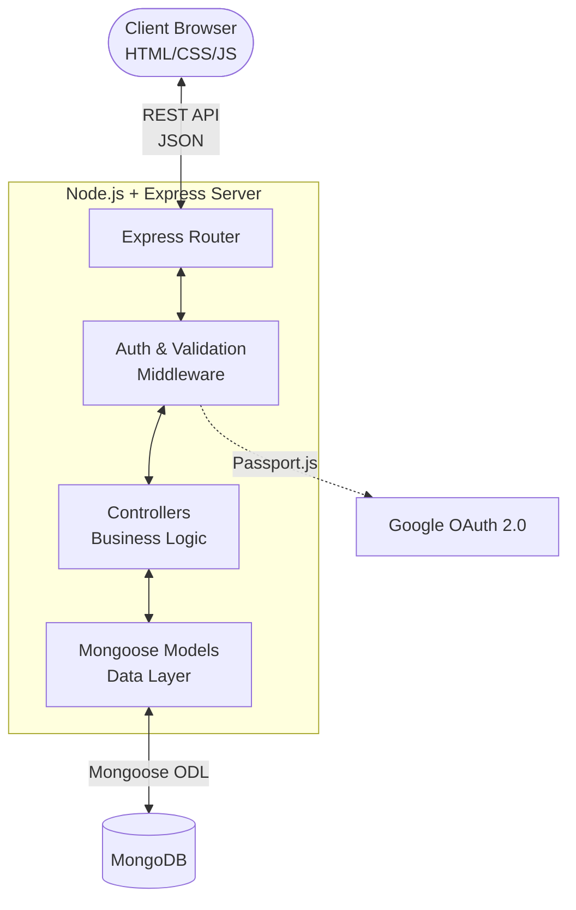
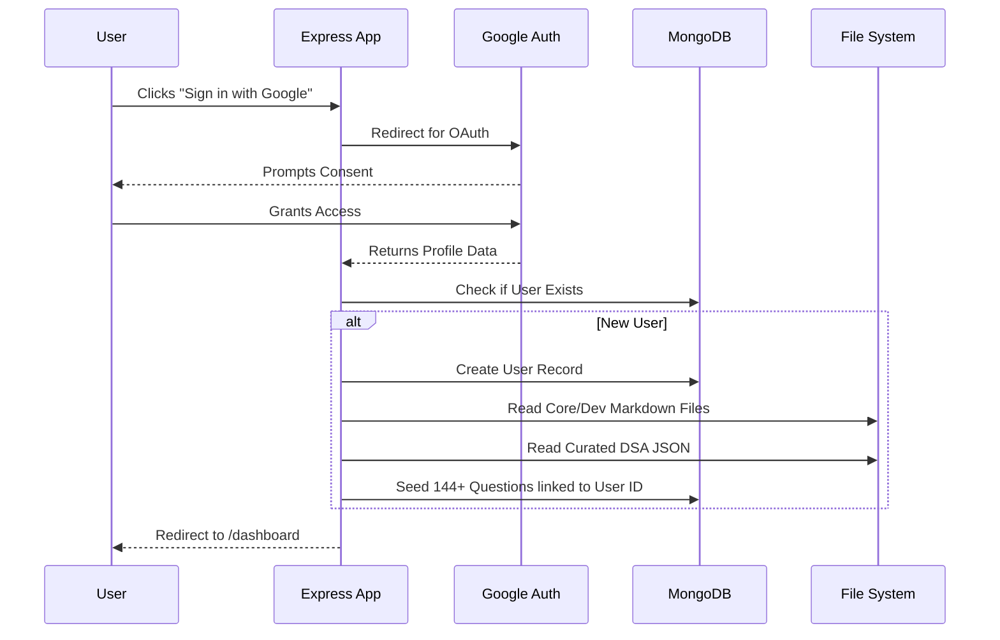

# 🚀 Placement Preparation Tracker

[](https://nodejs.org/)
[](https://expressjs.com/)
[](https://www.mongodb.com/)
[](https://developers.google.com/identity)
[](https://developer.mozilla.org/en-US/docs/Web/JavaScript)

A comprehensive, full-stack web application designed to help software engineering students organize and track their placement preparation. It provides a centralized dashboard for Data Structures & Algorithms (DSA), Core CS Subjects (DBMS, OOPS), and Development topics.

Built with **Node.js, Express, MongoDB**, and secured with **Google OAuth 2.0**, it features a clean **MVC architecture**, robust REST APIs, and a highly interactive Vanilla JS frontend.

---

## ✨ Key Features

| Feature | Description |
|---------|-------------|
| 🔐 **Google OAuth 2.0** | Secure, seamless authentication. No passwords to manage. |
| 🌱 **Smart Auto-Seeding** | New users are instantly greeted with 144 curated DSA questions, plus Core CS and Web Dev study material. |
| 🗂️ **Topic Encapsulation** | Questions and materials are neatly organized into collapsible Topic accordions. |
| 📝 **Markdown Support** | Core CS and Web Dev topics are rendered directly from Markdown files. |
| ✅ **Progress Tracking** | Mark questions as solved. Track overall progress with dynamic visual progress bars. |
| 🔍 **Live Search & Filters** | Instant, debounced search by title, and filtering by Company, Topic, and Status. |
| ✏️ **Notes & Favorites** | Attach personalized markdown notes to any topic, and star important questions for quick revision. |
| 📱 **Responsive UI** | Beautiful, modern dashboard optimized for desktop and mobile. |

---

## 🏗️ System Architecture

The application follows a strict **Model-View-Controller (MVC)** architectural pattern. 



---

## 🔄 Core User Flows

### Authentication & Auto-Seeding Flow
When a user signs in for the first time, the system automatically initializes their workspace by parsing local Markdown files and a curated DSA JSON dataset.



---

## 🛠️ Tech Stack

### Backend
* **Node.js & Express.js:** Fast, unopinionated web framework.
* **MongoDB & Mongoose:** NoSQL database with elegant object modeling.
* **Passport.js & Google OAuth20:** Enterprise-grade authentication.
* **Express Session:** Secure session management.

### Frontend
* **Vanilla JavaScript (ES6+):** Lightweight, dependency-free DOM manipulation.
* **Marked.js:** Parsing backend markdown content into rich HTML.
* **CSS3 & CSS Variables:** Custom, responsive design system.

---

## 🚀 Getting Started (Local Development)

### Prerequisites
- [Node.js](https://nodejs.org/) v18+
- [MongoDB](https://www.mongodb.com/) (Local instance or MongoDB Atlas URI)
- Google Cloud Console Account (for OAuth credentials)

### 1. Clone the repository
```bash
git clone https://github.com/Rishikajain123-tech/Placement-Preparation-tracker.git
cd Placement-Preparation-tracker
```

### 2. Install dependencies
```bash
npm install
```

### 3. Environment Configuration
Create a `.env` file in the root directory and configure it using the provided `.env.example` as a template:

```env
MONGODB_URI=mongodb://localhost:27017/placement-tracker
PORT=5000
NODE_ENV=development

# Google OAuth Credentials
GOOGLE_CLIENT_ID=your_google_client_id_here
GOOGLE_CLIENT_SECRET=your_google_client_secret_here

# Session Security
SESSION_SECRET=a_secure_random_string
```

### 4. Start the Application
```bash
# Start with auto-reload (Nodemon)
npm run dev

# Or start normally
npm start
```

### 5. Access the App
Open your browser and navigate to: `http://localhost:5000`

---

## 📁 Repository Structure

```text
Placement Tracker/
├── server.js                   # Express application entry point
├── package.json                # Dependencies & scripts
├── resources/                  # Core & Dev Markdown study material (Seeded on signup)
├── src/
│   ├── config/                 # DB connections, Passport OAuth strategies
│   ├── controllers/            # Request handlers & business logic
│   ├── data/                   # Initial datasets (DSA questions, Seed logic)
│   ├── middleware/             # Auth guards & input validation
│   ├── models/                 # Mongoose schemas (User, Question)
│   └── routes/                 # Express API routes
└── public/                     # Static assets (HTML, CSS, Client JS)
```

---

## 👨‍💻 Author

**Rishika Jain**
- GitHub: [@Rishikajain123-tech](https://github.com/Rishikajain123-tech)

## ⭐ Support

If you found this architecture or project useful, please consider giving it a ⭐ on GitHub!
