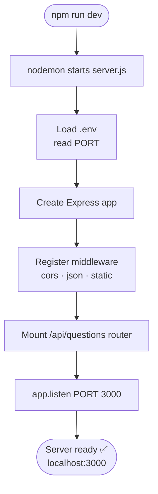
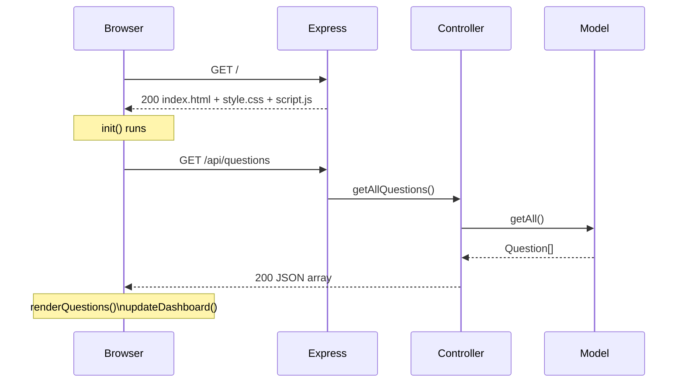
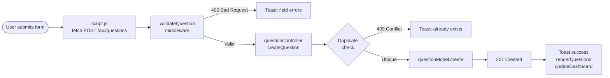
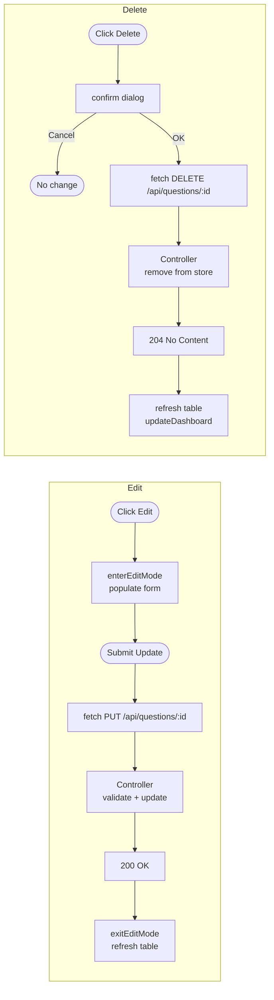

# 🚀 Placement Preparation Tracker

A full-stack web application to help students organise and track their DSA placement preparation efficiently. Built with **Node.js + Express** on the backend and **HTML, CSS, Vanilla JavaScript** on the frontend — following a clean **MVC architecture** with a RESTful API.

> 🔗 **Live Demo (static version):** https://rishikajain123-tech.github.io/Placement-Preparation-tracker/

---

## 📸 Project Preview


---

## ✨ Features

| Feature | Description |
|---------|-------------|
| ✅ Add Questions | Log DSA questions with company, topic, difficulty & status |
| ✏️ Edit Questions | In-place editing via the same form |
| 🗑️ Delete Questions | Confirm-then-delete with instant table update |
| 🔍 Live Search | Instant results as you type (title, company, topic) |
| 🏢 Company Filter | Filter by Amazon, Google, Microsoft, Adobe, Flipkart… |
| 📚 Topic Filter | Filter by Arrays, Trees, DP, Graphs and 9 more topics |
| 📊 Dashboard | Live stats — total, solved, remaining, % progress bar |
| 🚫 Duplicate Guard | Server-side check prevents same company + title twice |
| 🍞 Toast Alerts | Non-blocking success / warning / error notifications |
| 📱 Responsive | Works on desktop, tablet and mobile |
| 🔌 REST API | Clean JSON API — ready for mobile clients or CLI tools |

---

## 🛠️ Tech Stack

### Backend
| Technology | Role |
|-----------|------|
| Node.js | Runtime |
| Express 5 | HTTP server + routing |
| dotenv | Environment variable management |
| cors | Cross-origin requests |
| nodemon | Dev auto-restart |

### Frontend
| Technology | Role |
|-----------|------|
| HTML5 (semantic) | Structure |
| CSS3 + Custom Properties | Styling & design system |
| Vanilla JavaScript (ES6) | UI logic + `fetch()` API calls |
| Font Awesome 6 | Icons |
| Google Fonts — Poppins | Typography |

---

## 📂 Project Structure

```
Placement Tracker/
│
├── server.js                   ← Entry point — boots Express
├── package.json
├── .env                        ← PORT config (not committed)
├── .gitignore
│
├── src/                        ← All server-side source code
│   ├── config/
│   │   └── index.js            ← Central config (reads .env)
│   ├── models/
│   │   └── questionModel.js    ← Data layer (in-memory, DB-ready)
│   ├── controllers/
│   │   └── questionController.js  ← Business logic + HTTP responses
│   ├── routes/
│   │   └── questionRoutes.js   ← URL → controller mapping
│   └── middleware/
│       ├── errorHandler.js     ← Global error handler
│       └── validateQuestion.js ← Input validation + sanitisation
│
├── public/                     ← Static frontend (served by Express)
│   ├── index.html
│   ├── style.css
│   └── script.js               ← fetch()-based API client
│
└── README.md
```

---

## 🏗️ Architecture — MVC

```
┌─────────────────────────────────────────────────────────────┐
│                        MVC LAYERS                           │
│                                                             │
│  VIEW               CONTROLLER              MODEL           │
│  ──────────         ───────────────         ──────────────  │
│  public/            questionController      questionModel   │
│  index.html         .js                     .js             │
│  style.css                                                  │
│  script.js ──────►  Receives HTTP req  ───► Owns data       │
│  (fetch API)        Applies business        CRUD methods    │
│                     rules                   In-memory now   │
│                     Sends response          DB-ready later  │
└─────────────────────────────────────────────────────────────┘
```

---

## 🔄 Program Flow

### Application Boot



### Browser First Load



### Full CRUD Request Lifecycle


### Add Question Flow



### Edit & Delete Flow



---

## 🔌 REST API Reference

**Base URL:** `http://localhost:3000/api`

| Method | Endpoint | Description | Body | Response |
|--------|----------|-------------|------|----------|
| `GET` | `/questions` | Get all questions | — | `200 Question[]` |
| `GET` | `/questions/:id` | Get one question | — | `200 Question` |
| `POST` | `/questions` | Create question | `QuestionInput` | `201 Question` |
| `PUT` | `/questions/:id` | Update question | `QuestionInput` | `200 Question` |
| `DELETE` | `/questions/:id` | Delete question | — | `204 No Content` |

### Query Parameters (`GET /questions`)

| Param | Example | Effect |
|-------|---------|--------|
| `search` | `?search=two+sum` | Full-text match on title, company, topic |
| `company` | `?company=Google` | Filter by company |
| `topic` | `?topic=Arrays` | Filter by topic |
| `difficulty` | `?difficulty=Hard` | Filter by difficulty |
| `status` | `?status=Solved` | Filter by status |

### Question Schema

```json
{
  "id": 1724609400000,
  "company": "Google",
  "topic": "Arrays",
  "title": "Two Sum",
  "link": "https://leetcode.com/problems/two-sum/",
  "difficulty": "Easy",
  "status": "Solved"
}
```

### Error Response Schema

```json
{
  "error": "Validation failed. Please fix the following fields.",
  "fields": {
    "company": "Company is required.",
    "title": "Question title is required."
  }
}
```

---

## 🚀 Getting Started

### Prerequisites
- [Node.js](https://nodejs.org/) v18 or higher
- npm (comes with Node)

### 1 — Clone the repository

```bash
git clone https://github.com/Rishikajain123-tech/Placement-Preparation-tracker.git
cd Placement-Preparation-tracker
```

### 2 — Install dependencies

```bash
npm install
```

### 3 — Create the environment file

```bash
# Create a .env file in the project root
echo PORT=3000 > .env
```

Or manually create `.env`:
```
PORT=3000
```

### 4 — Start the server

```bash
# Development (auto-restart on file changes)
npm run dev

# Production
npm start
```

### 5 — Open the app

```
http://localhost:3000
```

> The server serves the frontend automatically — no separate frontend server needed.

---

## 🗂️ Supported Data Values

### Companies
`Amazon` · `Google` · `Microsoft` · `Adobe` · `Flipkart` · `Walmart` · `Other`

### Topics
`Arrays` · `Strings` · `Linked List` · `Stack` · `Queue` · `Binary Search` · `Trees` · `Graphs` · `DP` · `Greedy` · `Backtracking` · `Heap` · `Other`

### Difficulty
`Easy` · `Medium` · `Hard`

### Status
`Solved` · `Unsolved`

---

## 🔮 Future Improvements

| Feature | Status |
|---------|--------|
| Database integration (SQLite / MongoDB) | Planned — model interface is ready |
| User authentication | Planned |
| Dark mode | Planned |
| Export progress as PDF / CSV | Planned |
| Weekly analytics charts | Planned |
| Calendar-based study planner | Planned |
| Notes / hints per question | Planned |
| Coding streak tracker | Planned |

> The data layer (`src/models/questionModel.js`) is designed for a zero-friction DB swap — only that one file changes when a database is added.

---

## 👩‍💻 Author

**Rishika Jain**
- GitHub: [@Rishikajain123-tech](https://github.com/Rishikajain123-tech)

---

## ⭐ Support

If you found this project useful, give it a ⭐ on GitHub — it means a lot!
